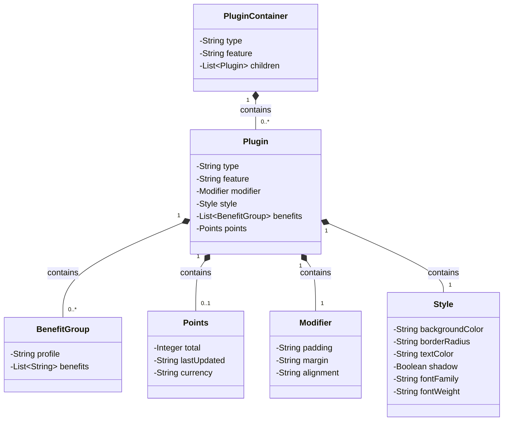
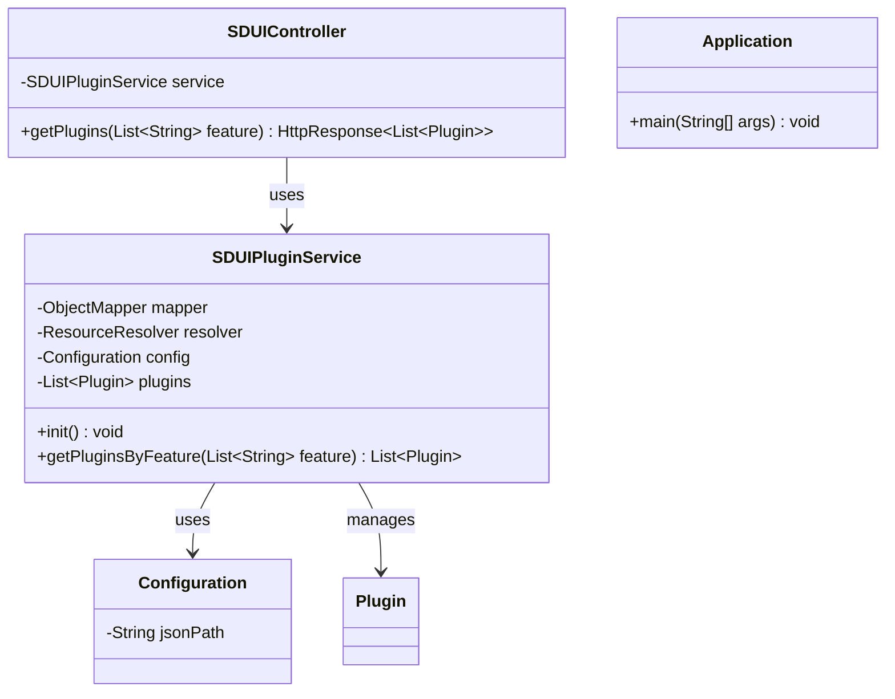

# Class Diagram

## Model Classes Relationship

## System Architecture

Note: This diagram is created using Mermaid markdown syntax. To view it properly, you'll need a Markdown viewer that supports Mermaid diagrams.
